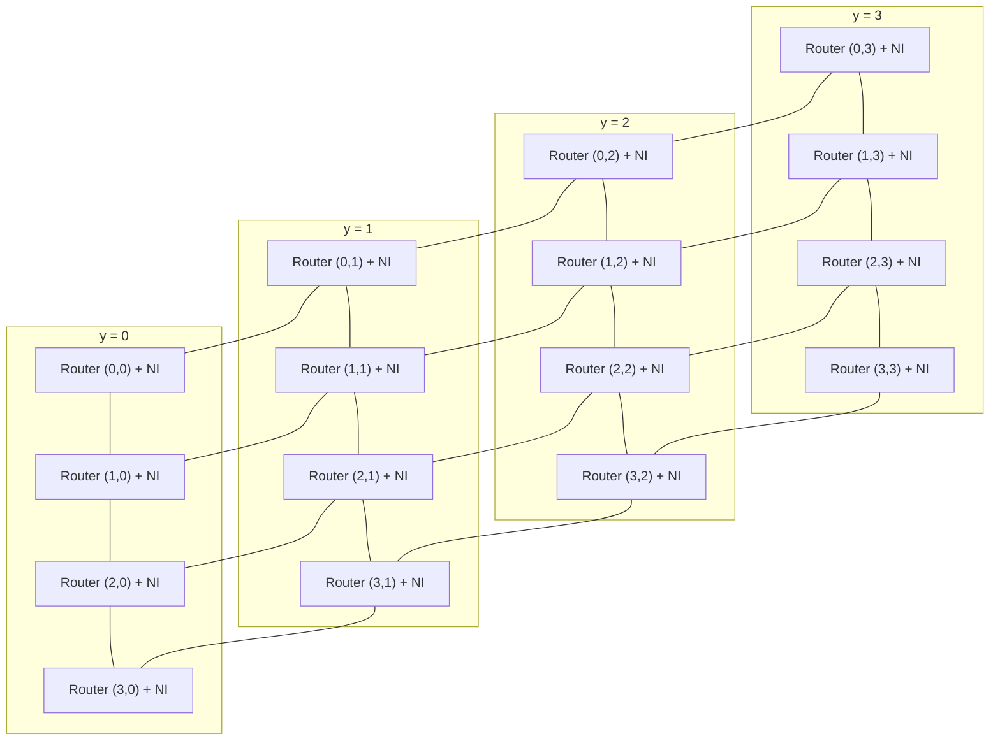
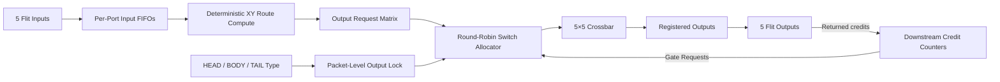

# CreditMesh NoC

> A simulation-verified SystemVerilog 4×4 mesh Network-on-Chip with deterministic XY routing, packet-level switch locking, round-robin arbitration, and credit-based flow control.

CreditMesh NoC connects 16 endpoints through a two-dimensional router fabric. Each node combines a five-port router with a network interface that converts 128-bit endpoint messages into flits, transports them across the mesh, and reconstructs them at the destination.

> **Project status:** verified using Vivado Behavioral Simulation. The design has not yet been synthesized, timed, or tested on an FPGA.

## At a glance

| Category | Current configuration |
|---|---|
| Topology | 4×4 bidirectional mesh |
| Nodes | 16 |
| Router ports | Local, North, South, East, West |
| Routing | Deterministic X-first XY routing |
| Flow control | Credit based |
| Virtual channels | 1 |
| Arbitration | One round-robin arbiter per output |
| Switching | Packet-level output locking |
| Endpoint message width | 128 bits |
| Flit payload | 32 bits |
| Complete flit width | 38 bits |
| Input FIFO depth | 16 flits by default |
| Verification | Unit, directed, scoreboard, and randomized stress tests |
| Simulator | Vivado Behavioral Simulation |

## Why this project exists

A Network-on-Chip replaces long shared buses with a structured packet-switched fabric. This project explores the hardware required to move messages reliably across such a fabric:

- packetization and message reassembly;
- deterministic routing across multiple hops;
- per-input buffering;
- fair output arbitration;
- packet-level switch ownership;
- downstream-credit tracking;
- end-to-end integrity checking under contention and backpressure.

The design is intentionally compact enough to understand module by module while still including the control paths expected in a practical NoC router.

## Mesh architecture

Each coordinate contains one router and one network interface. The local port connects the router to its endpoint; the four directional ports connect neighboring routers. Physical links are bidirectional even though each arrow below is drawn as a simple connection.



Node numbering follows:

```text
node_id = y × 4 + x
```

For example, node 0 is `(0,0)` and node 15 is `(3,3)`.

## End-to-end message flow


The network interface sends the least-significant 32-bit payload word first. With the default configuration, one 128-bit message becomes four flits.

## Five-port router

Every router contains five identical input paths and five output paths:



### Router pipeline

1. An incoming flit is accepted when its input FIFO is not full.
2. `route_compute.sv` chooses Local, North, South, East, or West.
3. The input unit requests the chosen output.
4. The request participates only when the downstream output has credit.
5. A round-robin arbiter chooses one requester for each output.
6. The crossbar connects the winning input to that output.
7. Consuming an input flit returns a credit to the upstream router.

## Deterministic XY routing

Routing resolves the X dimension before the Y dimension:

```text
if destination_x > current_x: EAST
else if destination_x < current_x: WEST
else if destination_y > current_y: NORTH
else if destination_y < current_y: SOUTH
else: LOCAL
```

Example route from node 0 `(0,0)` to node 15 `(3,3)`:

```text
EAST → EAST → EAST → NORTH → NORTH → NORTH → LOCAL
```

Deterministic XY routing is simple and deadlock-resistant for a conventional mesh because packets never reverse the dimension order.

## Packet and flit format

The package defines four flit types:

| Type | Encoding | Purpose |
|---|---:|---|
| `FLIT_HEAD` | `00` | Starts a multi-flit packet |
| `FLIT_BODY` | `01` | Carries an intermediate payload word |
| `FLIT_TAIL` | `10` | Ends a multi-flit packet |
| `FLIT_HEAD_TAIL` | `11` | Represents a complete single-flit packet |

### Default flit layout

| Field | Width | Description |
|---|---:|---|
| `flit_type` | 2 bits | Packet position |
| `dest_x` | 2 bits | Destination X coordinate |
| `dest_y` | 2 bits | Destination Y coordinate |
| `payload` | 32 bits | Message data |
| **Total** | **38 bits** | Complete packed flit |

Destination coordinates are carried in every flit because the current router performs route computation for each FIFO head.

## Credit-based flow control

Each output tracks the number of free entries in the downstream input FIFO:

- sending a flit consumes one credit;
- the downstream router returns a credit when it removes a flit from that input FIFO;
- requests are blocked when an output has no available credit;
- input FIFOs also expose ready/not-ready behavior to prevent overflow.

This allows backpressure to propagate across multiple routers without dropping data.

## Packet-level switch locking

A `HEAD` flit that wins an output locks that output to its input. `BODY` flits retain ownership, and the corresponding `TAIL` releases it. A `HEAD_TAIL` flit completes without leaving a persistent lock.

This prevents flits from competing packets from becoming interleaved on one output link.

## Module guide

| Module | Role |
|---|---|
| `params_pkg.sv` | Global dimensions, widths, flit structure, and direction types |
| `fifo.sv` | Parameterized synchronous input buffering |
| `credit_counter.sv` | Tracks downstream buffer availability |
| `rr_arbiter.sv` | Fair round-robin requester selection |
| `route_compute.sv` | Deterministic X-first XY routing decision |
| `input_unit.sv` | FIFO control, route capture, and request generation |
| `switch_alloc.sv` | Per-output arbitration and packet-level locking |
| `crossbar.sv` | Connects granted inputs to router outputs |
| `router.sv` | Complete five-port router datapath and control |
| `network_interface.sv` | Message packetization and reassembly |
| `mesh_4x4.sv` | Instantiates and connects 16 router/NI nodes |

## Verification strategy

Verification is divided into unit tests, focused integration tests, and complete-network tests. The testbenches are self-checking and report failures with `$error` or `$fatal`.

### Unit tests

| Testbench | Main checks |
|---|---|
| `fifo_tb.sv` | Reset, ordering, full/empty behavior, and pointer wraparound |
| `rr_arbiter_tb.sv` | One-hot grants, request validity, fairness, skipping, and wraparound |
| `route_compute_tb.sv` | Local and cardinal routes, boundaries, diagonals, and X-before-Y priority |
| `input_unit_tb.sv` | Buffering, FSM transitions, route capture, requests, and grants |
| `network_interface_tb.sv` | Packetization, flit types, payload order, reassembly, and backpressure |
| `packet_lock_tb.sv` | Contiguous HEAD/BODY/TAIL ownership under output contention |

### Integration tests

| Testbench | Main checks |
|---|---|
| `two_router_credit_flow_tb.sv` | Twelve three-flit packets crossing a two-router link with repeated credit return |
| `mesh_4x4_directed_tb.sv` | Exact node 0 to node 15 route, per-hop flit count, payload integrity, and unique delivery |
| `mesh_4x4_scoreboard_tb.sv` | 96 packets, all output directions, all destinations, receive backpressure, assertions, conservation, ordering, and corruption checks |
| `mesh_4x4_stress_tb.sv` | Concurrent random traffic from all 16 nodes, contention, watchdog monitoring, packet conservation, latency, and throughput |

### Directed integration example

The corner-to-corner test injects:

```text
128'h01234567_89ABCDEF_FEDCBA98_76543210
```

at node 0 and expects exactly the same message at node 15 after four intact flits traverse:

```text
E → E → E → N → N → N → LOCAL
```

A successful run prints:

```text
PASS: 4x4 mesh delivered 128-bit message node 0 (0,0) -> node 15 (3,3) over E,E,E,N,N,N with 4 intact flits.
```

### Verification support

| File | Purpose |
|---|---|
| `traffic_generator.sv` | Synthesizable randomized message source used by the stress test |
| `noc_assertions.sv` | Valid/ready stability and FIFO overflow/underflow assertions |
| `noc_watchdog.sv` | Detects a prolonged lack of progress while traffic is outstanding |

## Simulating in Vivado

1. Create a new **RTL Project** in Vivado.
2. Add the files under `rtl/` as design sources.
3. Ensure `rtl/package/params_pkg.sv` is compiled before modules that import `params_pkg`.
4. Add the desired file under `tb/` as a simulation source.
5. Add any support modules required by that test:
   - `mesh_4x4_scoreboard_tb.sv` uses `verification/noc_assertions.sv`.
   - `mesh_4x4_stress_tb.sv` uses `verification/traffic_generator.sv` and `verification/noc_watchdog.sv`.
6. Set the selected testbench module as the simulation top.
7. Select **Run Simulation → Run Behavioral Simulation**.
8. Run until the testbench prints its PASS result or terminates with an error.

Useful simulation tops include:

```text
mesh_4x4_directed_tb
mesh_4x4_scoreboard_tb
mesh_4x4_stress_tb
```

## Vivado/XSim port compatibility

Multi-dimensional and unpacked array ports are legal SystemVerilog. However, some Vivado/XSim versions and project configurations handle unpacked arrays—particularly arrays of packed structs crossing module boundaries—inconsistently.

For portability, the router boundary uses flattened packed vectors such as:

```systemverilog
logic [NUM_PORTS*FLIT_WIDTH-1:0] flit_in_flat;
logic [NUM_PORTS-1:0]            flit_valid_flat;
```

The design converts these vectors back into per-port `flit_t` signals internally. This is a tool-compatibility decision rather than a SystemVerilog language requirement.

## Repository layout

```text
credit-mesh-noc/
├── rtl/
│   ├── package/
│   │   └── params_pkg.sv
│   ├── common/
│   │   ├── fifo.sv
│   │   ├── credit_counter.sv
│   │   └── rr_arbiter.sv
│   ├── router/
│   │   ├── route_compute.sv
│   │   ├── input_unit.sv
│   │   ├── switch_alloc.sv
│   │   ├── crossbar.sv
│   │   └── router.sv
│   └── network/
│       ├── network_interface.sv
│       └── mesh_4x4.sv
├── tb/
│   ├── unit/
│   │   ├── fifo_tb.sv
│   │   ├── rr_arbiter_tb.sv
│   │   ├── route_compute_tb.sv
│   │   ├── input_unit_tb.sv
│   │   ├── network_interface_tb.sv
│   │   └── packet_lock_tb.sv
│   └── integration/
│       ├── two_router_credit_flow_tb.sv
│       ├── mesh_4x4_directed_tb.sv
│       ├── mesh_4x4_scoreboard_tb.sv
│       └── mesh_4x4_stress_tb.sv
├── verification/
│   ├── traffic_generator.sv
│   ├── noc_assertions.sv
│   └── noc_watchdog.sv
├── LICENSE
└── README.md
```

## Design decisions

- **One virtual channel:** keeps the control path understandable while preserving explicit buffering and allocation stages.
- **Deterministic XY routing:** provides predictable paths and avoids routing cycles associated with arbitrary turns.
- **Packet-level output locking:** prevents packet interleaving without requiring additional packet identifiers on a link.
- **Credit-based flow control:** prevents downstream FIFO overflow and propagates congestion upstream.
- **Message-level endpoint interface:** keeps endpoint logic independent of the internal flit protocol.
- **Flattened top-level ports:** improves compatibility with Vivado/XSim elaboration.

## Current limitations

- Mesh dimensions are currently configured as 4×4 through `params_pkg.sv`.
- Only one virtual channel is implemented.
- Routing is deterministic and does not adapt around congestion or faults.
- There is no quality-of-service or priority mechanism.
- Each network interface allows one transmit message and one receive message to be outstanding.
- Packets must not be interleaved on the network-interface ejection path.
- Destination coordinates are repeated in every flit.
- The current verification does not represent exhaustive formal proof of every traffic pattern.
- The design is simulation-verified only and has not been synthesized or tested on hardware.

## Roadmap

- [x] Five-port mesh router
- [x] Input buffering and credit tracking
- [x] Deterministic XY routing
- [x] Round-robin switch arbitration
- [x] Packet-level output locking
- [x] Network-interface packetization and reassembly
- [x] 4×4 mesh integration
- [x] Unit and directed integration verification
- [x] Scoreboard-driven and randomized stress testing
- [ ] Multiple virtual channels
- [ ] Parameterized mesh dimensions at the top level
- [ ] Adaptive or congestion-aware routing
- [ ] Quality-of-service support
- [ ] Automated regression scripts
- [ ] FPGA synthesis and timing analysis
- [ ] Hardware demonstration

## Learning outcomes

This project demonstrates how to:

- build a flit-based packet network in RTL;
- coordinate route computation, allocation, switching, and flow control;
- preserve packet boundaries under contention;
- propagate backpressure using credits;
- connect routers into a scalable mesh topology;
- verify packet conservation, ordering, routing, and payload integrity;
- use directed, assertion-based, scoreboard-driven, and randomized testing together.

## License

This project is available under the MIT License. See `LICENSE` for details.

## Author

Designed and developed by **MD Reyan**.
